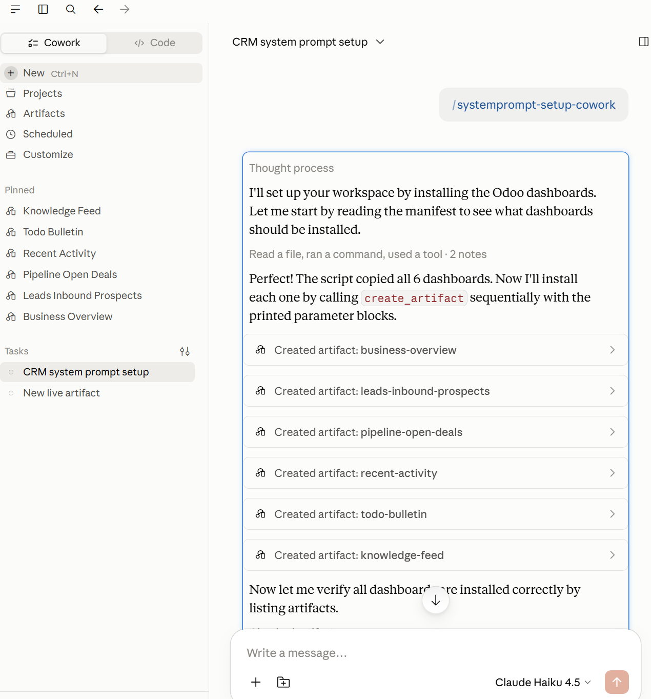
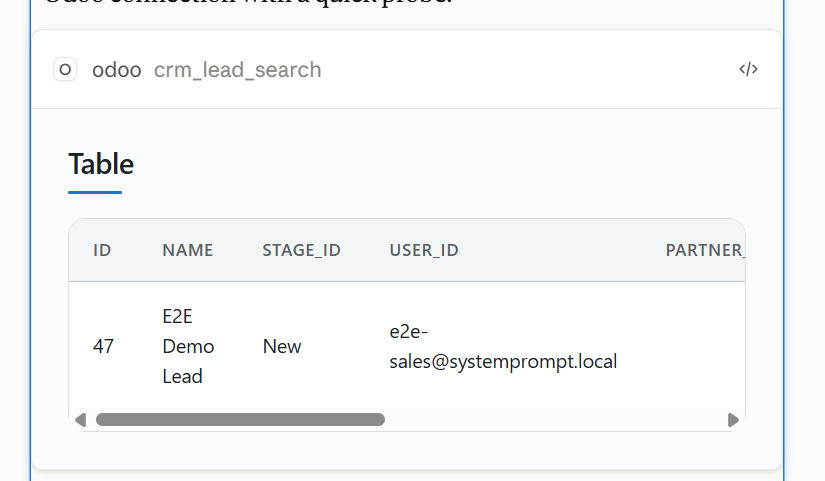
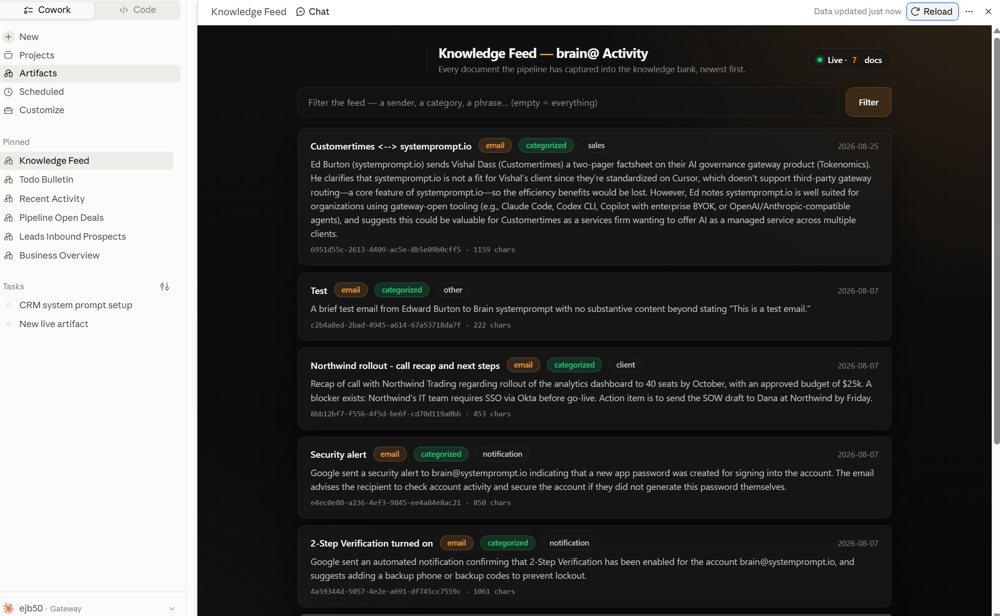

# Testing the full flow: users → login → skills → artifacts → MCP

**Summary (human, 30 seconds).** This machine runs the whole product locally:
a gateway on `:8081`, Odoo on `:8070`, MCP servers as subprocesses, and the
bridge that syncs skills + dashboards into Claude Cowork. Two seeded Odoo
users (`ed@systemprompt.io` and `ed+notadmin@systemprompt.io`,
password `e2e-live-password-2026`) carry different roles, so switching users
switches the skills, dashboards, and tools you see. The loop for any change
is: edit code or YAML → `just build` → `just start` → `just e2e` /
`just e2e-live` → on Windows `bridge sync` + re-run the setup skill. Every
credential in this file is local test data.

---

## 1. Stand the stack up

```bash
just db-up local          # Docker Postgres + Odoo (first time: just odoo-local-init)
just build                # DEBUG build — the local loop never needs --release
just start                # API :8081, MCP subprocesses; publish_pipeline runs at boot
curl -s http://localhost:8081/health          # 200
just e2e                  # in-process suite: roles, manifests, MCP wire (~20s)
just e2e-live             # live two-role journey; ALSO (re)seeds the test users
```

`just start` refuses to trample a server another agent is running — check
`just server-status` first. Restart one MCP server without a full bounce:
`systemprompt infra services restart mcp odoo --profile local`.

## 2. Users, login, logout

| Account | Password | Platform role (mapped from Odoo groups) |
|---|---|---|
| `ed@systemprompt.io` | `e2e-live-password-2026` | `admin, user` |
| `ed+notadmin@systemprompt.io` | `e2e-live-password-2026` | `user` |
| Odoo UI admin | `admin` / `admin` at `http://localhost:8070` (db `odoo_local`) | — |

- **Login (browser):** `http://localhost:8081/admin/login` — Odoo email +
  password (API key if the Odoo user has 2FA), or passkey for platform
  operators. First sign-in JIT-creates the platform account; roles come from
  `services/access-control/odoo-roles.yaml` via `res.users.has_group`.
- **Role switching is live:** change a user's groups in Odoo (Settings →
  Users), sign in again — promotion AND demotion apply at the next sign-in.
  Verify with `systemprompt admin users list`.
- **Logout (browser):** the admin UI logout button, or from the device-link
  page click **"Not you? Use a different account"** — it clears the session
  cookies and returns to login with the link flow preserved.
- **Bridge login/logout (per machine):**
  ```
  systemprompt-internal-bridge login <sp-live-…> --gateway http://localhost:8081
  systemprompt-internal-bridge whoami
  systemprompt-internal-bridge logout      # purges token cache + sync state
  ```
  Mint a PAT: `systemprompt admin users api-key issue --user <email> --name test`
  (secret prints once). The browser device-link flow works too — the approval
  page shows which account it links and lets you switch.

## 3. Edit a skill and see it in Cowork

Skills live at `services/skills/<id>/{config.yaml,SKILL.md}`, auto-discovered.
A skill reaches a client only if an **enabled plugin** includes it
(`services/plugins/<id>/config.yaml` → `skills.include`) and the marketplace
includes that plugin. `hosts: [cowork]` / `[codex]` in a skill's config
targets it at one host; empty means all.

1. Edit `SKILL.md` (or add a new skill dir + plugin include).
2. `bash scripts/validate-services.sh` — referential integrity in seconds.
3. Restart the server (`just start` after a stop) — the manifest is assembled
   from disk per request, but restart to be certain nothing is cached.
4. Assert server-side without any client:
   ```bash
   TOKEN=$(systemprompt admin session login --email ed@systemprompt.io --token-only --profile local)
   curl -s -H "Authorization: Bearer $TOKEN" http://localhost:8081/v1/bridge/manifest \
     | python3 -c "import json,sys;p=json.loads(json.load(sys.stdin)['payload']);print(sorted(s['id'] for s in p['skills']))"
   ```
5. On Windows: `bridge sync`, restart Cowork, check the `/` skill picker.
   Admin-gated skills (roles.yaml `[admin]` block) appear only for admins.

## 4. Edit a dashboard artifact

`services/artifacts/<id>/{config.yaml,view.html}` is the **single source of
truth**. The setup skills' bundled copies are generated — never edit them.

1. Edit `view.html`; bump `version:` in `config.yaml`.
2. Plugin bundles ship `artifacts/manifest.json` + `<id>.html` generated by core from `services/artifacts/`; nothing to regenerate by hand
   (`--check` is the drift gate CI runs).
3. Restart, then in Cowork: `bridge sync` → run **systemprompt_setup**
   → it reports your artifact as *stale* → accept the replacement. The skill
   matches by id only and verifies each installed allowlist, repairing
   mismatches itself.

Data contract: tools answer with **typed structured content** (e.g.
`crm_lead_search` → a table artifact with `columns` + `items` keyed on Odoo
field names). Views read `structuredContent.items`; markdown parsing is a
fallback only. New tools follow `LeadRow` in
`extensions/mcp/odoo/src/server/crm_shape.rs` — typed structs, never
hand-walked JSON.

## 5. Edit the MCP server

Code: `extensions/mcp/odoo/src/` (tools in `tools/catalog.rs`, handlers in
`server/`). Registration: `services/mcp/odoo.yaml` (port 5040, oauth) —
ports must agree with `extensions/mcp/odoo/manifest.yaml`.

```bash
cargo build -p systemprompt-mcp-odoo                       # rebuild just the server
systemprompt infra services restart mcp odoo --profile local
systemprompt plugins mcp call odoo crm_lead_search --args '{"limit": 3}' --profile local
```

Or the full protocol via MCP Inspector: `npx @modelcontextprotocol/inspector`,
Streamable HTTP, `http://localhost:8081/api/v1/mcp/odoo/mcp` — the OAuth
dance signs you in as an Odoo user and every tool runs **as that user**
(Odoo's own record rules apply; a salesperson can't post on records they
can't touch).

## 6. Onboarding walkthroughs (do these once, in order)

### 6a. Add a field to an existing dashboard (Leads: add "Phone")

The data is typed end to end — a field exists in exactly three places:

1. **The typed row** — `extensions/mcp/odoo/src/server/crm_shape.rs`:
   add `pub phone: Option<String>` to `LeadRow` with
   `#[serde(deserialize_with = "odoo::text", default)]`, and a
   `Column::new("phone", ColumnType::String).with_header("Phone")` in
   `lead_table` (the field is already in `LEAD_FIELDS`, so Odoo returns it;
   a brand-new Odoo field would also join that list in `server/call.rs`).
2. **The view** — `services/artifacts/leads-inbound-prospects/view.html`:
   add `{ label: "Phone", path: "phone", cell: "text" }` to its `COLUMNS`
   array; bump `version:` in the sibling `config.yaml`.
3. **The regenerated bundle** — `just publish` (core emits `artifacts/manifest.json` + `<id>.html` per plugin bundle)
   (never edit the copies under `services/skills/*/assets/`).

Then: `cargo build -p systemprompt-mcp-odoo` →
`systemprompt infra services restart mcp odoo --profile local` →
`just e2e` (extend `tests/unit/mcp/src/odoo_lead_table.rs` and the mock's
`crm.lead` record with the new field) → in Cowork: `bridge sync`, re-run
the setup skill, accept the stale replacement. Removing a field is the same
three places in reverse.

### 6b. Modify a skill

Skills are instructions, not code: edit
`services/skills/<id>/SKILL.md` (behaviour) or `config.yaml` (name,
description, `hosts:` targeting). Then
`bash scripts/validate-services.sh`, restart the server, and confirm the
new sha rides the manifest (section 3's curl). Cowork picks the change up
at the next `bridge sync` — skills are re-synced wholesale, no reinstall
step.

### 6c. New feature end to end: tool → artifact → skill

The worked shape, using a hypothetical "Won Deals" board. Copy the nearest
existing example at every step — that is the intended workflow.

1. **Tool** (`extensions/mcp/odoo/`): declare `TOOL_WON_LEADS` in
   `tools/mod.rs` + a `ToolDef` in `tools/catalog.rs` (`read_only: true` —
   required for Cowork to cache dashboard fetches); add a typed input in
   `tools/inputs/`; write the handler in `server/` returning
   `(CliArtifact::table(...), summary)` built from a typed row struct
   (copy `LeadSearchHandler` + `LeadRow`); register the handler where the
   others are wired in `server/mod.rs`. Unit-test the domain and the table
   in `tests/unit/mcp/`.
2. **Artifact**: `services/artifacts/won-leads/{config.yaml,view.html}` —
   copy `leads-inbound-prospects` wholesale; set `id`, `name`,
   `mcp_tools: ["mcp__odoo__won_leads"]`, and the embedded contract
   `{"tool": "mcp__odoo__won_leads", "arguments": {...}}`; adjust the
   `COLUMNS` array. The view reads `structuredContent.items` — no parsing.
3. **Wire it into the plugin**: `services/plugins/systemprompt-user/config.yaml`
   → add the artifact id under `artifacts.include` (and the skill id under
   `skills.include` in step 4). Run `just publish`
   so the setup-skill bundle gains the new dashboard.
4. **Skill**: `services/skills/won_leads_review/{config.yaml,SKILL.md}` —
   `hosts: [cowork]` if it drives the dashboard; the SKILL.md tells the
   agent when to call the tool and open the artifact.
5. **Access**: if the feature is admin-only, add rules for the skill (and
   tool's server, if new) to `services/access-control/roles.yaml`;
   otherwise it rides the marketplace's `[user]` grant. Check with
   `systemprompt admin access-control lint`.
6. **Prove it**: `bash scripts/validate-services.sh` →
   `cargo build -p systemprompt-mcp-odoo` → restart → extend the e2e
   harness (mock arm in `tests/e2e/src/harness/odoo_mock.rs`, wire
   assertion beside `crm_lead_search`'s in `mcp_proxy_odoo.rs`, allowlist
   pin in `skills_artifacts.rs`) → `just e2e` → `bridge sync` + setup skill
   in Cowork → the new dashboard installs and loads live data.

## 7. What the flow looks like (annotated screenshots)

Reference captures live in `docs/testing/` — each is one of the three UI
surfaces, owned by a different piece of code, edited a different way.

### 7a. The full flow: skill → MCP → artifacts



`/systemprompt_setup` executing in Cowork: the agent reads the
bundled manifest, stages the HTML, calls `create_artifact` once per record,
and verifies the install — the workspace dashboards appear under *Pinned*. The
behaviour is **prose, not code**:
`services/skills/systemprompt_setup/SKILL.md` plus its
`scripts/setup.sh`. Edit the SKILL.md to change how the agent installs or
verifies; the bundle it installs is generated (section 4). Start a new
setup-style skill by copying this directory — section 6c step 4.

### 7b. Inline MCP-UI: a tool result rendered in chat



`crm_lead_search`'s typed `TableArtifact` rendered inline in the
conversation. Nothing in this repo draws it: the tool returns
`CliArtifact::table(...)` (`extensions/mcp/odoo/src/server/crm.rs`), core
persists it and serves a `ui://` resource that Cowork mounts. The renderer
is core's registry:
`../systemprompt-core/crates/domain/mcp/src/services/ui_renderer/` —
`table.css` styles this table, `tokens.css` holds the `--mcpui-*` design
tokens every renderer shares (OKLCH, `light-dark()`; a literal hex in a
sibling sheet is a bug). **To improve this table's styling**, edit core's
`table.css` against the tokens, rebuild the server, restart, and re-run the
tool — no change in this repo at all. To give a new tool an inline UI, just
return the right `CliArtifact` variant (Table, Chart, List, …); the
renderer comes free.

### 7c. A full dashboard artifact



The Knowledge Feed — a standalone page in Cowork's artifact library:
`services/artifacts/knowledge-feed/view.html` calls
`window.cowork.callMcpTool("mcp__knowledge-bank__list_documents")` on load
and renders the feed itself. All styling is inline CSS in that one file
(house style: dark OKLCH palette, branded `18px 6px 18px 18px` corner
radius) — edit it, bump the version, run the sync script, re-install as
stale (section 4). A new dashboard is section 6c step 2.

**This one is a historical illustration.** `knowledge-feed` is shelved
(`enabled: false`) and `knowledge-bank` now carries no role grant, so it ships
to nobody — the mechanism is identical for the four live Odoo dashboards, e.g.
`recent-activity` calling `mcp__odoo__note_search`.

### 7d. Testing all three without Cowork: MCP Inspector

`npx @modelcontextprotocol/inspector` → Streamable HTTP →
`http://localhost:8081/api/v1/mcp/odoo/mcp` → the browser OAuth flow signs
you in as any test user. Then:

- **Tools tab → `crm_lead_search`** returns the same structured table as
  7b (`structuredContent.columns/items`) — assert the contract without any
  rendering.
- **Resources tab** lists the `ui://odoo/...` resources — open one to see
  the exact HTML core serves to Cowork for the inline UI.
- The dashboards' data path is the same wire: call the tool named in an
  artifact's embedded contract with its embedded arguments and you have
  reproduced exactly what the page fetches (an empty result here means the
  dashboard would be empty too — that's Odoo answering, not a UI bug).

## 8. Debugging, in the order that finds things

```bash
systemprompt infra logs view --level error --since 10m     # first stop
systemprompt infra services status --profile local         # is a subprocess crashed?
systemprompt plugins mcp logs odoo                         # MCP server logs (also logs/mcp-odoo.log)
systemprompt infra logs trace list --limit 20              # every MCP tool call
systemprompt infra logs request list --limit 10            # every AI/gateway request
systemprompt infra logs audit <request-id>                 # full chain for one request
systemprompt-internal-bridge doctor                        # client-side one-liners
```

Known shapes: a 401 on the MCP proxy = the token wasn't minted for that
resource (RFC 8707) or is malformed; "session user mismatch" = stale client
session state (bridge logout/login); an empty dashboard = check the artifact's
cached tool result in Cowork's `artifacts/cache_<id>.json`. On Windows, all
Cowork state is under
`%LOCALAPPDATA%\Claude-3p\local-agent-mode-sessions\<id>\` (artifacts.json,
`artifacts/cache_*.json`, `cowork_plugins/`) — readable from WSL via `/mnt/c`.

---

## Agent instructions

You are working in `/var/www/html/systemprompt-internal` (sibling core at
`../systemprompt-core`; internal `next` builds against core `next` via the
ACTIVE `[patch.crates-io]` block). Ground rules: work lands on `next` with no
local gate cycles (see CLAUDE.md); the local loop is `just build` (debug) +
`just start`; never restart a server another agent owns; integration code
uses typed serde models, never `.get()` chains over `serde_json::Value`.

**To verify any change end to end, prefer the automated journey first:**

1. `just e2e` — boots the full production router in-process against a
   throwaway DB with a wiremock Odoo, and drives: per-role manifest diffs,
   Odoo sign-in + group→role mapping (promotion, demotion, fail-safe), the
   real `systemprompt-mcp-odoo` binary over the MCP Streamable-HTTP wire
   (note_add/note_list/note_search "%", crm_lead_search table contract), and
   skill/artifact bundle delivery. Sources: `tests/e2e/src/`.
2. `just e2e-live` — the same journey over real HTTP against the running
   stack; idempotently seeds the two Odoo users and their demo lead. Run it
   after any rebuild+restart. It never starts or stops services itself.
3. Only then reach for manual curl/Inspector steps (sections 2–6 above) to
   demonstrate something to the user.

**When adding surface area, extend the harness in the same change:** a new
tool gets a mock arm in `tests/e2e/src/harness/odoo_mock.rs` plus a wire
assertion in `mcp_proxy_odoo.rs`; a new dashboard gets its allowlist pinned
in `skills_artifacts.rs` and its assets regenerated via
the plugin bundle emitter in core; a new role-gated entity gets a
manifest-diff assertion in `manifest_roles.rs`.

**Seeded fixtures an agent may rely on:** the `e2e-*` users above (recreate
with `just e2e-live`), the `marketplace-admin` OAuth client with redirect
`/admin/login`, and Docker Postgres reachable via the URL in
`.systemprompt/profiles/local/secrets.json`. PATs for headless bridge tests
come from `admin users api-key issue`. Windows-side verification happens
through `/mnt/c` as described in section 8 — read Cowork's caches instead of
guessing what the client saw.
